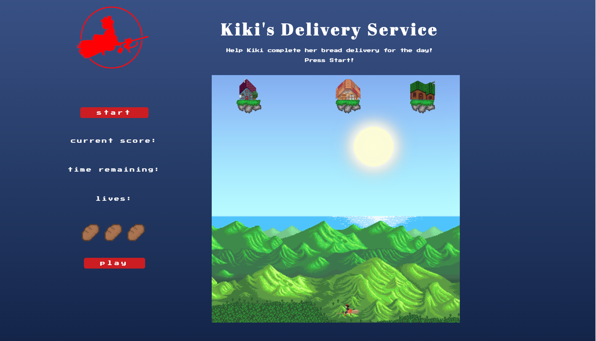
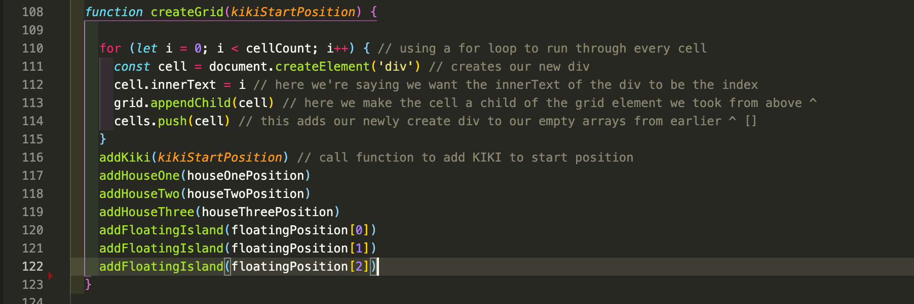
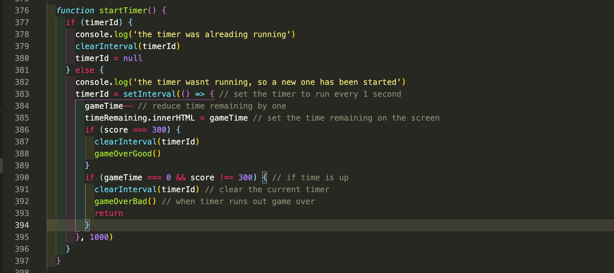

# PROJECT 1 - Kiki’s Delivery Service 🧹  
## Brief
My first project at General Assembly’s Software Engineering Immersive Course was to create a grid-based game that used HTML, CSS, and JavaScript learnt in the first two weeks of the course. This was a solo project to be completed in one week.

This game was deployed via GitHub pages and works best on a desktop with a keyboard.

Timeframe: 1 week.

## Find the deployed app here: [Kiki’s Delivery Service](https://msgilling.github.io/SEI-Project-1/) 

## Technologies

- HTML5
- CSS3
- JavaScript 
- Git, GitHub & GitHub Pages
- Google Fonts
- VSCode
- Google Chrome Developer Tools

## Approach taken
### Planning:
To begin, I started off writing the basic functionality I needed to achieve as my MVP with some basic pseudo-code. I planned what I would need such as the grid, starting position, obstacles, lives and a way to win and lose.

### Grid:
I created the grid using a JavaScript function. Using this for loop, I was able to create new divs that were appended as children to the parent div. During the development stage, I was able to keep track of any attached classes thanks to the index of each div being displayed.

Next I wrote the function that enabled the keyboard movement for Kiki. I made a starting position div for Kiki and created keydown event listeners to allow the player to control Kiki’s movement when the corresponding keys are pressed. I made sure to add logic so that the player cannot make Kiki leave the grid.

Next, I used the indexes of the other divs for the obstacles and the end goals. Once the player pressed play, that triggered the startTimer() and moveEagles()/movePlanes() function. I created the interval function set to 1000ms so that the obstacles would move one cell per second across the grid. This timer will keep counting down until Kiki loses all her lives or gains all the points at the floating houses through if statements.

### Collision detection:
When the player moves Kiki and she hits an obstacle such as an eagle or plane the player will lose a life and if she loses all her lives she invokes the gameOverBad() function.

Once this happens, the corresponding hidden div changes from **none** to **block** to display the loseGameScreen for the player. Clicking on the red button refreshes the page to start over.

## Bugs
You can move Kiki around the board before even starting the game.
Different screen sizes means that the grid can sometimes cover the tagline at the top of the page.

## Challenges
- This was my first ever project using JavaScript so I faced many hurdles, the largest being the planes moving in reverse and disappearing. This was fixed by putting them into reverse() so not to overlap one another.
- - Another challenge I had was collision detection for losing lives and winning points. Conceptually, I think I found it confusing in the beginning but once I figured out that if both classes were present in said div then further events can be triggered.

## Wins
- I think for my first ever coded project this was a huge win for me. 
- Learning how to make a grid with JavaScript.
- Really happy with the finished styling using just CSS.

## Key Learnings
- *JS Fundamentals*: This was my first big coding project ever and really helped me understand the basics of JS array methods and working with timers and learning to solve problems.
- *Working Independently*: I had to learn the hard way that sometimes taking a break was a good thing when I wasn’t making much progress even though I wanted to push through. Giving yourself a break can give you much needed rest and then you can come back with a clearer mind.

## Future Features
- Different difficulty levels.
- A highscore board using localStorage.
- The bread icons change when Kiki loses a life.
- Add some CSS animations to the floating houses.
- I also wanted to add some objects that Kiki could ‘hop’ onto and the collision detection would be the background for that - section.
